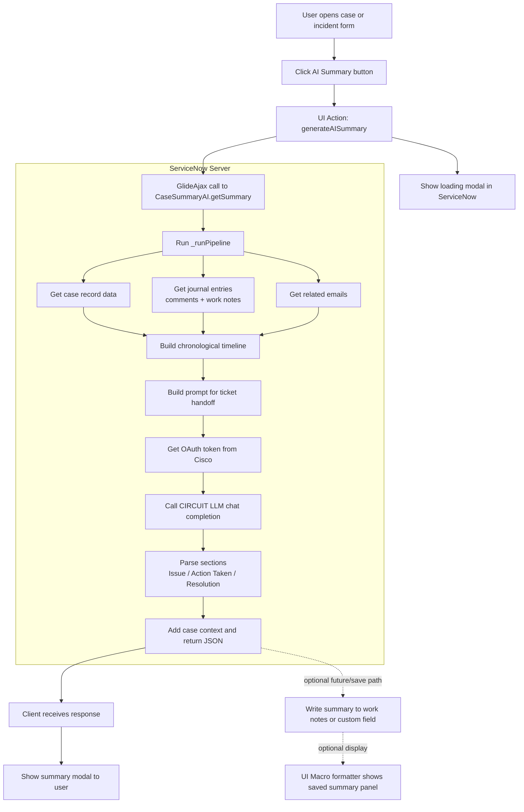

# Current Workflow - Case Summary AI

This is the current rough workflow of the ServiceNow-native solution as it works today.

## Manager Summary

- User opens a case or incident in ServiceNow.
- User clicks the `AI Summary` button.
- Client-side UI Action calls the `CaseSummaryAI` Script Include through `GlideAjax`.
- Server-side script reads case data, journal entries, and emails.
- ServiceNow builds a clean timeline and prompt.
- ServiceNow gets an OAuth token from Cisco.
- ServiceNow calls CIRCUIT LLM to generate the summary.
- The response is parsed into `Issue`, `Action Taken`, and `Resolution`.
- The summary is returned to the UI and shown in a modal popup.
- Optional formatter panel can display a saved summary if the summary is written to a field.

## Mermaid Diagram

## Notes

- The current button flow uses `getSummary`, which returns the generated summary to the popup.
- The save path exists in `generateAndSave`, but it is not the main path used by the current UI Action.
- This makes the current workflow good for quick preview and review.
- If needed, the next enhancement is to wire the button to also save the generated summary automatically.
