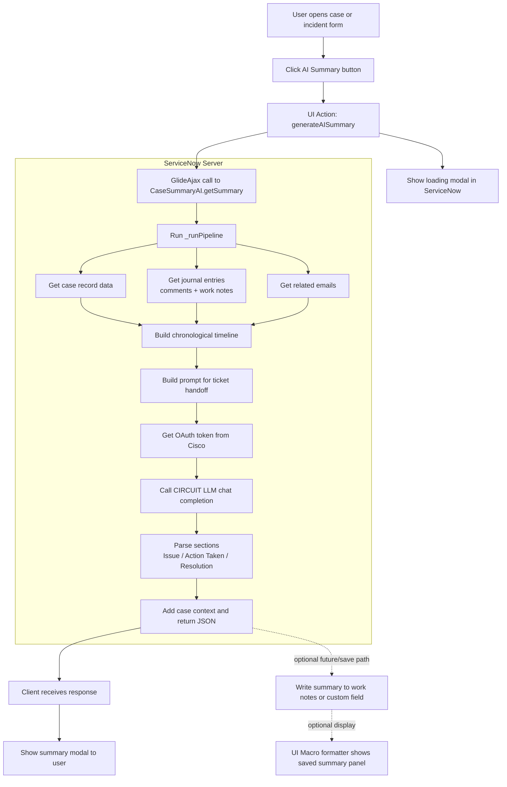
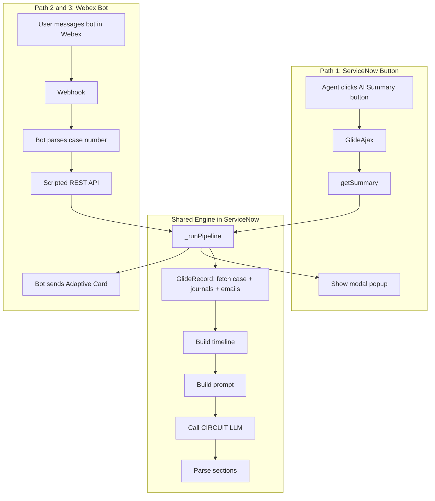

# Current Workflow - Case Summary AI

This is the current rough workflow of the ServiceNow-native solution as it works today.

## Overview

- User opens a case or incident in ServiceNow.
- User clicks the `AI Summary` button.
- Client-side UI Action calls the `CaseSummaryAI` Script Include through `GlideAjax`.
- Server-side script reads case data, journal entries, and emails.
- ServiceNow builds a clean timeline and prompt.
- ServiceNow gets an OAuth token from Cisco.
- ServiceNow calls CIRCUIT LLM to generate the summary.
- The response is parsed into `Issue`, `Action Taken`, and `Resolution`.
- The summary is returned to the UI and shown in a modal popup.
- Optional formatter panel can display a saved summary if the summary is written to a field.

## Mermaid Diagram



## All 3 Paths to Get a Summary

All paths share the same core engine: `CaseSummaryAI._runPipeline()`

### Path 1 — ServiceNow Button (✅ working)

```
Agent opens case form → clicks "AI Summary" button
→ GlideAjax → CaseSummaryAI.getSummary() → _runPipeline
→ summary shown in popup modal
```

**File:** `ui_action/ai_summary_button.js` → `script_include/CaseSummaryAI.js`

### Path 2 — Webex Bot Direct Message (new)

```
User DMs bot: "summary CS-12345"
→ Webex webhook → bot parses case number
→ bot calls ServiceNow Scripted REST API
→ ServiceNow runs _runPipeline (same logic as button)
→ bot sends Adaptive Card back in Webex
```

**Files:** `webex_bot/summary_command.py` → `scripted_rest_api/CaseSummaryAPI.js` → `script_include/CaseSummaryAI.js`

### Path 3 — Webex Space (bot in a room) (new)

```
User @mentions bot in space: "@BotName summary CS-12345"
→ same flow as Path 2
→ bot replies with Adaptive Card in the space
```

**Files:** Same as Path 2 — the bot handles both DM and space messages.

### Architecture Diagram



## Notes

- All paths reuse `_runPipeline` — one place to maintain the logic.
- The Webex bot does NOT use Lambda — it calls ServiceNow directly via the Scripted REST API.
- Path 1 uses `GlideAjax` (browser to server). Paths 2 and 3 use the REST API (external to server).

---

## Code-Level Flow — Step by Step

This section explains exactly what happens in the code, which function calls which, and what is happening in the background at each step.

---

### Step 1 — User clicks the button
**File:** `ui_action/ai_summary_button.js`
**Function:** `generateAISummary()`

```
User clicks "AI Summary" button
  → ServiceNow runs generateAISummary() on the client (browser side)
```

What happens inside:
- `g_form.getUniqueValue()` gets the `sys_id` of the current record
- `g_form.getTableName()` gets the table name (e.g. `sn_customerservice_case`)
- A loading spinner modal is shown to the user immediately so they know something is happening

---

### Step 2 — Client calls the server
**File:** `ui_action/ai_summary_button.js`
**Still inside:** `generateAISummary()`

```
generateAISummary()
  → creates GlideAjax('CaseSummaryAI')
  → adds params: sysparm_name = 'getSummary', sysparm_sys_id, sysparm_table
  → calls ga.getXMLAnswer(callback)
```

What happens in background:
- `GlideAjax` sends an async HTTP request from the browser to the ServiceNow server
- The browser does NOT freeze — it waits in the background
- The loading modal stays visible while waiting

---

### Step 3 — Server receives the call
**File:** `script_include/CaseSummaryAI.js`
**Function:** `getSummary()`

```
getSummary()
  → reads sysparm_sys_id and sysparm_table from the request
  → validates that sys_id exists
  → calls this._runPipeline(sysId, table)
  → returns JSON.stringify(result) back to the browser
```

What happens in background:
- ServiceNow checks that the request has a valid `sys_id`
- If missing, it immediately returns `{ success: false, error: 'Missing sys_id' }`
- Otherwise it hands off to the main pipeline function

---

### Step 4 — Pipeline starts
**File:** `script_include/CaseSummaryAI.js`
**Function:** `_runPipeline(sysId, table)`

```
_runPipeline()
  → calls _getCaseData(sysId, table)
  → calls _getJournalEntries(sysId)
  → calls _getEmails(sysId, table)
  → calls _buildTimeline(journalEntries, emailEntries)
  → calls _buildPrompt(caseData, timeline)
  → calls _callCircuitLLM(prompt)
  → calls _prependCaseContext(rawSummary, caseData)
  → calls _parseSections(rawSummary)
  → returns final result object
```

This is the master function. It calls every other function in order and assembles the final result.

---

### Step 5 — Fetch case data
**Function:** `_getCaseData(sysId, table)`

```
_getCaseData()
  → new GlideRecord(table)
  → gr.get(sysId)
  → reads fields: number, short_description, description, state, priority,
                  severity, assignment_group, assigned_to, category,
                  impact, urgency, sys_created_on, sys_updated_on
  → returns a plain object with all case fields
```

What happens in background:
- `GlideRecord` is the ServiceNow way to query the database (like SQL SELECT)
- It reads one record directly by `sys_id` — very fast
- Returns `null` if the record is not found, which stops the pipeline with an error

---

### Step 6 — Fetch journal entries
**Function:** `_getJournalEntries(sysId)`

```
_getJournalEntries()
  → queries sys_journal_field table
  → filter: element_id = sysId AND element IN (comments, work_notes)
  → ordered by sys_created_on (oldest first)
  → returns array of { timestamp, element, value, created_by }
```

What happens in background:
- `sys_journal_field` is the ServiceNow table that stores all comments and work notes
- Every comment or work note ever added to the case is fetched here
- If nothing is found by `element_id`, it retries using `name` field (fallback for older records)

---

### Step 7 — Fetch emails
**Function:** `_getEmails(sysId, table)`

```
_getEmails()
  → queries sys_email table
  → filter: instance = sysId AND target_table = table
  → ordered by sys_created_on
  → returns array of { timestamp, body_text, type, subject }
```

What happens in background:
- `sys_email` stores all inbound and outbound emails linked to the record
- The body text is extracted — HTML tags are stripped later in `_cleanText()`

---

### Step 8 — Build timeline
**Function:** `_buildTimeline(journalEntries, emailEntries)`

```
_buildTimeline()
  → loops through journal entries
      → cleans text with _cleanText()
      → maps element type to speaker label (comments → customer, work_notes → support_engineer)
  → loops through email entries
      → cleans text with _cleanText()
      → labels as speaker: customer
  → merges all entries into one array
  → sorts by timestamp (oldest first)
  → returns sorted timeline array
```

What happens in background:
- `_cleanText()` strips HTML tags, collapses whitespace, and trims to 1000 chars max
- This gives the LLM a clean, readable chronological story of the case

---

### Step 9 — Build the prompt
**Function:** `_buildPrompt(caseData, timeline)`

```
_buildPrompt()
  → formats timeline into numbered lines:
      "1. [timestamp] speaker: text"
  → combines case metadata + timeline into one prompt string
  → includes strict rules for the LLM (no PII, no hallucination, deduplicate)
  → tells the LLM exactly what format to return
  → returns the full prompt string
```

What happens in background:
- This is the equivalent of what `formatter.py` + `summarizer.py` used to do in the old Python pipeline
- The prompt instructs the LLM to return exactly three sections: `Issue`, `Action Taken`, `Resolution`

---

### Step 10 — Get OAuth token from Cisco
**Function:** `_callCircuitLLM(prompt)` → internally calls `_getAccessToken()`

```
_getAccessToken(clientId, clientSecret, tokenUrl)
  → reads clientId and clientSecret from System Properties
  → Base64 encodes clientId:clientSecret
  → sends POST to Cisco token URL with grant_type=client_credentials
  → parses response and returns access_token string
```

What happens in background:
- This is the standard OAuth2 client credentials flow
- Credentials are stored securely in ServiceNow System Properties (not hardcoded)
- The token is used only for this one LLM call and is not stored

---

### Step 11 — Call CIRCUIT LLM
**Function:** `_callCircuitLLM(prompt)`

```
_callCircuitLLM()
  → reads model, chatBaseUrl, appKey from System Properties
  → builds chat completion request body:
      { messages: [system prompt + user prompt], temperature: 0.05, max_tokens: 600 }
  → sends POST via RESTMessageV2 to CIRCUIT LLM endpoint
  → checks HTTP status (must be 200)
  → parses JSON response
  → extracts choices[0].message.content
  → returns raw summary text
```

What happens in background:
- `RESTMessageV2` is the ServiceNow built-in HTTP client (like `axios` or `requests`)
- Temperature `0.05` means the LLM gives very consistent, factual answers (not creative)
- The `appKey` identifies your application to Cisco CIRCUIT

---

### Step 12 — Parse the summary into sections
**Function:** `_parseSections(rawSummary)`

```
_parseSections()
  → splits the raw LLM text by newlines
  → looks for known headers: Issue, Action Taken, Resolution, SLA Information
  → collects lines under each header
  → returns object: { Issue: "...", "Action Taken": "...", Resolution: "..." }
```

What happens in background:
- The LLM was instructed to use exact headers, so this parsing is reliable
- Each section's text is stored separately so the UI can display them in styled boxes

---

### Step 13 — Add case context header
**Function:** `_prependCaseContext(rawSummary, caseData)`

```
_prependCaseContext()
  → builds a one-line metadata string:
      "CS-12345 -- Priority: P2 | State: Open | Group: CX Team | Updated: 2026-04-16"
  → prepends it to the summary text
  → returns the final full summary string
```

---

### Step 14 — Return result to browser
**Back in:** `getSummary()` → returns JSON

```
getSummary()
  → returns JSON.stringify({ success: true, summary, sections, case_number, ... })
  → GlideAjax callback in browser receives this as a string
  → JSON.parse() converts it back to an object
```

---

### Step 15 — Show summary to user
**File:** `ui_action/ai_summary_button.js`
**Function:** `_showAISummaryPanel(recordNum, result)`

```
GlideAjax callback
  → closes the loading modal
  → calls _showAISummaryPanel(recordNum, result)
      → reads result.sections (Issue, Action Taken, Resolution)
      → builds styled HTML
      → opens a GlideModal popup with the formatted summary
```

What happens in background:
- If `result.success` is `false`, `_showErrorDialog()` is called instead to show the error
- The popup is styled to match the ServiceNow AI Assist panel look

---

### Full Call Chain Summary

```
generateAISummary()                         ← browser, button click
  → GlideAjax → getSummary()               ← server entry point
      → _runPipeline()                      ← master pipeline
          → _getCaseData()                  ← reads case fields
          → _getJournalEntries()            ← reads comments + work notes
          → _getEmails()                    ← reads linked emails
          → _buildTimeline()               ← merges + sorts + cleans
              → _cleanText()               ← strips HTML, trims text
          → _buildPrompt()                 ← formats prompt for LLM
          → _callCircuitLLM()              ← calls Cisco CIRCUIT
              → _getAccessToken()          ← gets OAuth2 token first
          → _prependCaseContext()          ← adds case metadata header
          → _parseSections()               ← splits into Issue/Action/Resolution
      ← returns JSON result
  ← GlideAjax callback receives result
      → _showAISummaryPanel()              ← renders styled modal popup
```
